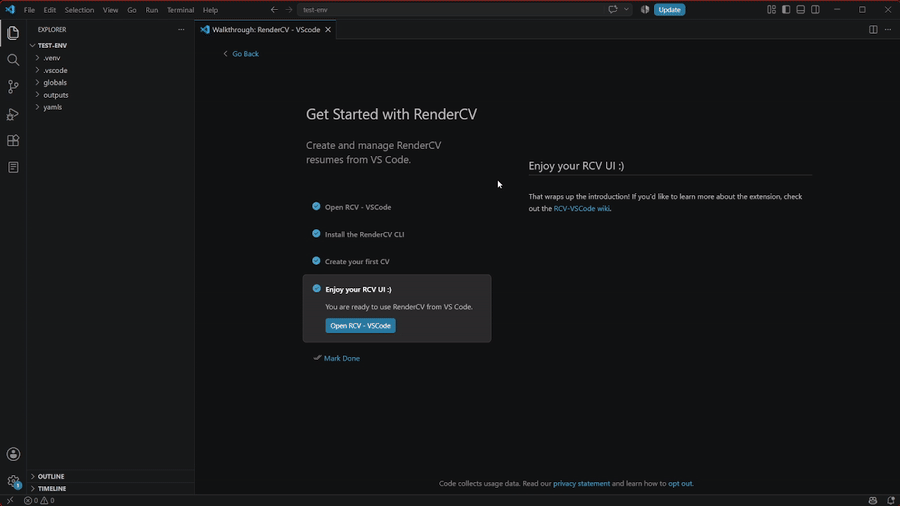

# Automatic Rendering

Automatic rendering is the core feature of RCV-VSCode.

This feature automatically triggers the necessary RenderCV CLI command with proper syntax to generate a new PDF, then opens the generated PDF in a side panel.

:::info[WIP]

This feature is not completed, see below for more information.

The current implementation fully depends on other PDF providers, which limits the performance of the extension, this will be changed in the future.

:::

## Available modes

### on-click

Only trigger PDF rendering when clicking the CV in the RCV-VSCode side bar (basically disable automatic functionality, making it manual).

### on-save

Trigger PDF rendering every time you save your YAML file, automatically updating the displayed PDF.

### auto

Automatically trigger PDF rendering every time you make changes to your YAML file, using your `Auto Render Cooldown` configuration to decide how long to wait between each change to actually trigger the rendering.

:::warning[Work in progress]

This feature is temporarily disabled because it made it way too difficult to edit YAML files while looking at your PDF, it will be fixed in a future update.

:::

## How to change modes

Open the RCV-VSCode side bar and click the cog wheel on the top-right corner, this will automatically VSCode settings for the extension, that's where you can change the auto-render mode to whichever you like.

Changing autorender GIF

