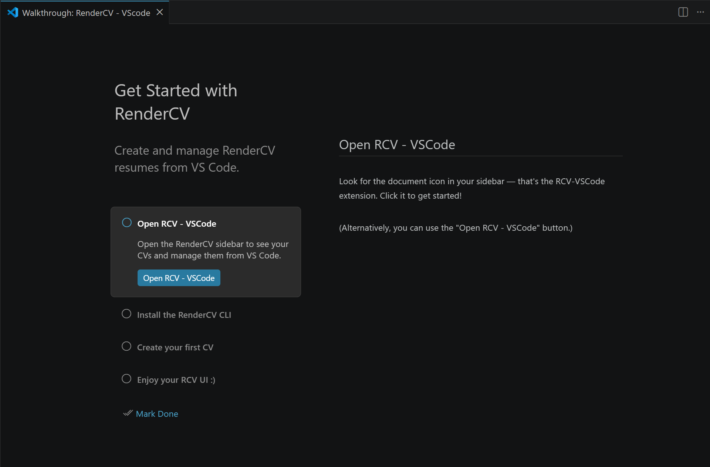

# Tutorial Intro

:::info[WIP]

This whole documentation is a work in progress, so please be patient with us ;)

:::

Welcome to the RCV - VSCode tutorial!

Here you will learn everything about our extension, from how to use it, to frequently asked questions.

  
Built-in Walkthrough

You can see a built-in tutorial (not as rich as this one, though) directly in VSCode!

Just do the following:

1. Open the Command Palette (`Ctrl + Shift + P`)
2. Look for the `*Open Walkthrough*` command
3. Select the `*Get started with RCV - VSCode*` walkthrough

Once you open it, you will something like the next image, just follow the instructions there for a quick setup, remember that you can always come back here for more information :)

