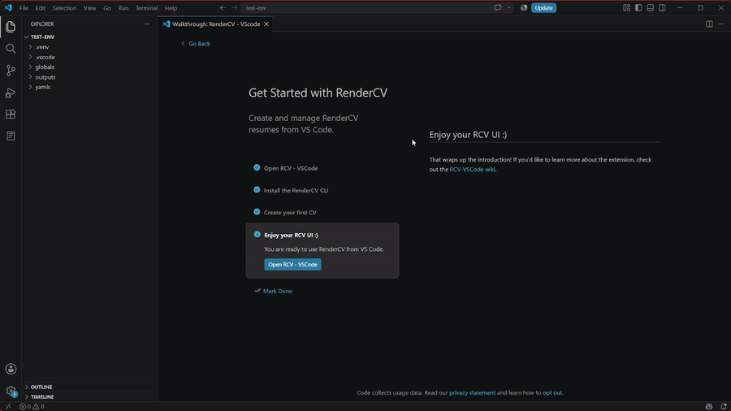

# Clonar CVs

Clonar un CV es igual de sencillo que crear uno:

GIF de clonación de CV

1. Abre la barra lateral de RCV-VSCode
2. Haz clic derecho en el CV que quieres clonar, o haz clic en los 3 puntos verticales a la derecha de cualquier CV
3. Selecciona "Clone CV"
4. Aparecerá una nueva ventana, similar a la ventana de creación de CV, que hereda las configuraciones del CV clonado
5. Cambia lo que quieras cambiar, o déjalo igual, pero al menos usa un nuevo nombre para el CV
6. Baja y haz clic en el botón azul "Clone CV"
