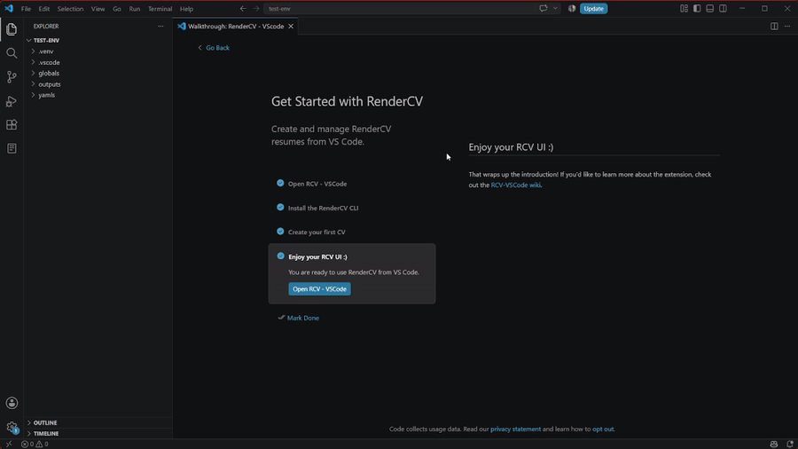

# Configuraciones

GIF de configuración

- `rendercv-vscode.autoRenderCooldown`: Tiempo, en milisegundos, que se espera después de un cambio en el archivo antes de volver a renderizar automáticamente el CV. Valor predeterminado: `400`.

- `rendercv-vscode.autoRenderType`: Controla cuándo se renderiza el CV.
  - `auto` *(deshabilitado temporalmente)*: Detecta automáticamente los cambios en el archivo y vuelve a renderizar después del tiempo de espera configurado.
  - `on-save (default)`: Vuelve a renderizar solo cuando se guarda un archivo.
  - `on-click`: Vuelve a renderizar solo cuando se hace clic en el botón de vista previa.

- `rendercv-vscode.defaultOutputPath`: Carpeta predeterminada donde se guardan los CVs generados. Déjala vacía para usar la ruta predeterminada de RenderCV.

- `rendercv-vscode.defaultTheme`: Tema predeterminado que se usa al crear nuevos CVs. Opciones disponibles:
  - `classic` *(default)*
  - `moderncv`
  - `sb2nov`

- `rendercv-vscode.renderCVCliPath`: Ruta al ejecutable de la CLI de RenderCV. Si RenderCV está instalado globalmente, puedes dejarla vacía. El asistente de configuración intentará detectar instalaciones globales, en entornos virtuales o con `uv` automáticamente.

- `rendercv-vscode.CVYamlFilesFolder`: Carpeta que contiene tus archivos YAML de RenderCV. Valor predeterminado: `yamls`.
