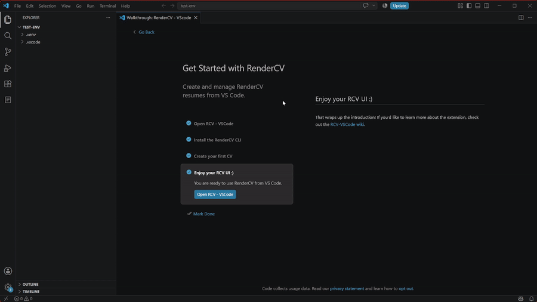

# Crear un CV

Puedes crear un CV en 5 (4!) pasos sencillos:

GIF de creación de CV

1. Abre la barra lateral de RCV-VSCode
   - Está ubicada en la barra lateral de VSCode y se muestra como un ícono de hoja.

2. Haz clic en el botón "Create new CV"
   - Este botón está en la barra lateral de RCV-VSCode.

3. Llena los campos requeridos
   - La vista te indicará cuáles campos son obligatorios, así que puedes dejar algunos vacíos sin problema.

:::info

La primera vez que crees un CV, se te pedirá crear configuraciones globales, que se tomarán de ese primer CV que crees. Puede que no parezca tan importante al principio, pero conviene tenerlo en cuenta.

Si quieres aprender más sobre configuraciones globales y locales, [lee esta publicación al respecto](../extra-features/globals-and-locals.mdx).
:::

4. Haz clic en el botón azul "Create CV" al final
   - Puede que tengas que bajar un poco para verlo.

5. Disfruta tu nuevo CV! :D

No te preocupes por la administración de archivos; la extensión se encarga de todo para que tu flujo de trabajo se mantenga dentro de nuestra barra lateral personalizada.
