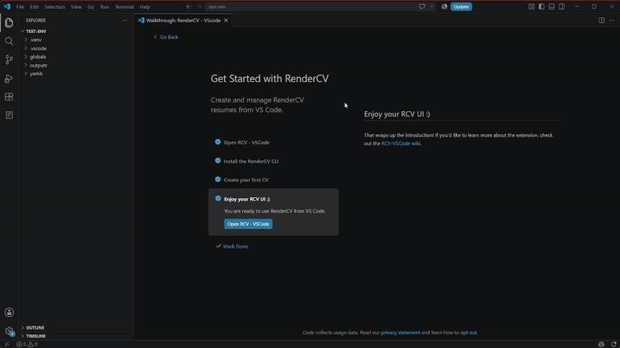

# Vista previa y salida final

Ver tu CV final es igual de sencillo que editarlo:

1. Haz clic en la barra lateral de RCV-VSCode
2. Haz clic derecho en el CV que quieres ver
3. Haz clic en "Reveal Output PDF"
4. Tu PDF se mostrará en el explorador de archivos de tu sistema operativo

GIF de salida del CV

