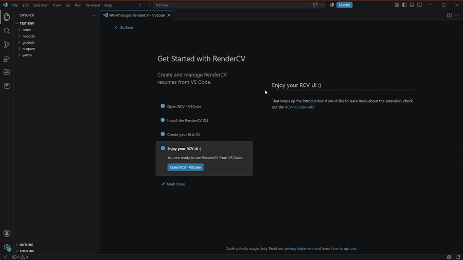

# Editar CVs

Editar un CV es muy sencillo:

GIF de edición de CV

1. Haz clic en la barra lateral personalizada de RCV-VSCode (ícono de hoja)
2. Selecciona el CV que quieres editar, lo cual lo abrirá directamente
3. Espera a que se genere y se muestre la vista previa del PDF
4. Edita tu archivo YAML como prefieras
5. Guarda tu archivo y ve tu PDF actualizado, si tienes habilitado el renderizado al guardar

:::info

Para ver el archivo PDF real que puedes subir a cualquier lugar, lee [el siguiente tutorial](./cv-output.mdx).

:::
